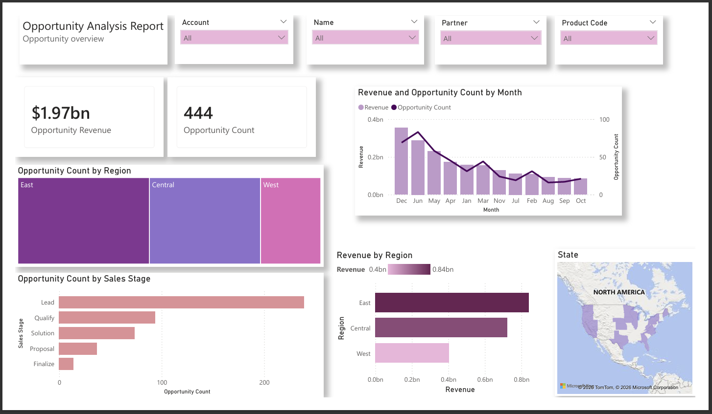
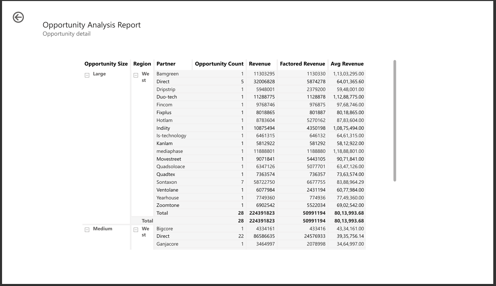
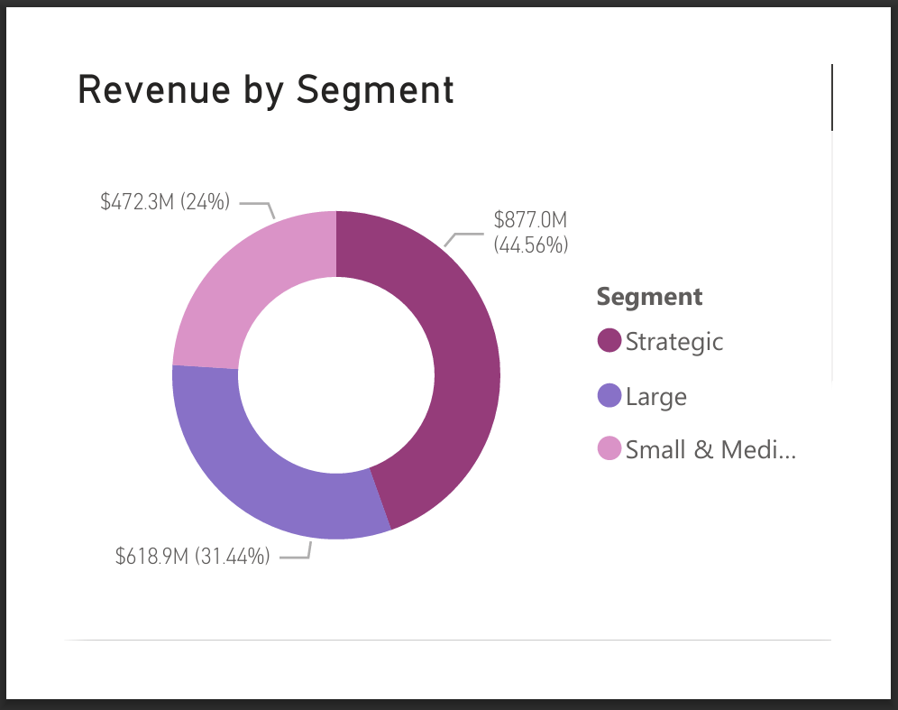

# Sales Opportunity Revenue Analysis Dashboard using Power BI

## Overview
This project is a Power BI dashboard developed for Sales Opportunity and Revenue Analysis.  
The dashboard helps analyze opportunity performance, revenue contribution, partner analysis, and segment-wise business insights using interactive visualizations.

The project uses:
- Power BI
- Power Query
- DAX
- Interactive Dashboard Design

---

## Objectives
- Analyze sales opportunities
- Monitor revenue performance
- Evaluate partner contribution
- Study revenue distribution by segment
- Support business decision-making

---

## Features
- Opportunity Analysis Dashboard
- Revenue by Segment Visualization
- Opportunity Count Analysis
- Factored Revenue Insights
- Average Revenue Analysis
- Partner-wise Opportunity Tracking
- Region-wise Performance Breakdown
- Interactive Reports and Navigation

---

# Dashboard Screenshots

## Main Dashboard

---

## Opportunity Analysis Report

---

## Revenue by Segment

---

## Key Insights
- Strategic segment contributes the highest share of revenue.
- Large segment generates significant business opportunities.
- Revenue performance varies across partners and regions.
- Opportunity size impacts overall profitability.
- Factored revenue helps identify high-value opportunities.

---

## Technologies Used
- Power BI
- Power Query
- DAX
- Data Visualization Techniques

---

## Dataset
Business opportunity dataset containing:
- Opportunity details
- Partner information
- Revenue metrics
- Regional analysis
- Segment classification

---

## Project File
The Power BI `.pbix` project file is included in this repository.

---

## Future Improvements
- Add predictive revenue forecasting
- Real-time data integration
- AI-based business insights
- Advanced KPI monitoring

---

## Author
Bhavya Padukone
